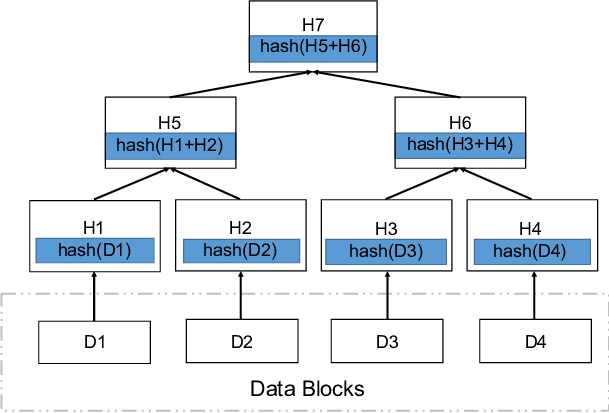

# Engineering Notebook for Final Project:
Engineering notebook of our Proof for our mini-IPFS implementation. Final Project for CS 262 @ Harvard.

## Introduction to IPFS
File sharing has traditionally been viewed as a centralized process. With the advent of the internet, the most popular method for online file sharing involved a central server holding the files and clients requesting the contents of the files whenever they needed access. Many simple systems rely on this method for file sharing. However, as discussed in class, this form of file management is vulnerable to failure since users will not be able to retrieve their files if the central server goes down. Companies have traditionally circumvented the server being the single point of failure by initializing many different servers. The centralized system for file sharing also faces issues such as security and version control. 

Launched in 2015, InterPlanetary File System (IPFS) served as a decentralized alternative for file-sharing. IPFS is a distributed, peer-to-peer file system that provides a more efficient and decentralized way to store and share data across the internet. Unlike traditional web technologies that rely on centralized servers, IPFS is designed to work without a central point of control, allowing anyone to participate in the network and contribute storage and bandwidth resources.

IPFS stores multiple copies of files across different nodes in the network, providing redundancy and ensuring data availability even if some nodes go offline. This means that files can be accessed and downloaded faster, and the network is more resilient to failures or attacks. In addition, IPFS can offload traffic from central servers, reduce latency, and improve download speeds, making it a more scalable and performant alternative to traditional web technologies.

To ensure data integrity, IPFS uses cryptographic hashing to create unique content identifiers (CIDs) for each file. This means that identical files will have the same CID, and any changes made to a file will result in a new CID. This ensures that files cannot be tampered with or altered without detection, providing a secure and reliable way to store and share data.

IPFS has many potential use cases, including decentralized web hosting, distributed databases, peer-to-peer content delivery, and more. Its open-source nature and community-driven development make it an exciting and rapidly evolving technology that is changing the way we think about data storage and sharing on the Internet.

## Project Goal
For our CS 262 final project, we seek to recreate a mini-version of the IPFS protocol and then simulate a proof of concept by storing and retrieving a simple text file. That goal will involve the following: designing a data structure to represent files, implementing IPFS nodes that are capable of storing chunks of data, implementing communication between IPFS nodes, and building a web-based UI in which a user can upload files to receive a hash as well as input a hash to receive files. 

## Implementation Methodology
To implement IPFS, we will need to spin up multiple servers, come up with a way to allocate file chunks across different servers and implement a way to recreate files across different machines. The sections below detail the choices we made in implementing all of the features needed for our user experience.

## Creating an IPFS Node

The IPFS node will be the core data structure that does all operations related to IPFS. We will utilize a primary secondary server structure for our IPFS nodes. Our primary IPFS nodes will handle client requests for uploading and retrieving files. It will also delegate file chunk uploading / retrieval from peer IPFS nodes. Our secondary IPFS nodes will be responsible for storing file chunks, keeping track of their corresponding hashes, and handling primary server requests to either store a file chunk within the secondary server or retrieve the chunk corresponding to a given file hash. The following subsections will go over our implementation for the primary and secondary IPFS nodes. The IPFS node can be found in `backend/ipfs.py`. 

### Splitting Files

Within our primary IPFS node, we need to split up a given file into chunks, create a Merkle DAG out of the hashes of these chunks, and send the chunks to peer IPFS nodes for storage. 

To split our file into chunks, we first chose a standard block size (256 bytes). Then, when a client uploads a file to the primary IPFS node, it 

Next, for file storage, we rely on the Merkle Directed Acyclic Graph Data structure (Merkle DAG). 

A Merkle DAG (Directed Acyclic Graph) is a data structure used by IPFS to efficiently store and retrieve files in a decentralized network. In a Merkle DAG, each node represents a piece of data, and each edge represents a cryptographic hash that links nodes together. The result is a tree-like structure where every node is uniquely identified by a hash of its contents and the hashes of its children.

Here is an illustration of the Merkle DAG that we will use:

Merkle DAGs are well-suited for IPFS since they verify the integrity of files without relying on a centralized authority. That is, when a file is added to IPFS, its contents are hashed, and the resulting hash is used as the root of a Merkle DAG. Each chunk of the file is then hashed and linked together in a tree-like structure, with each node representing a unique piece of data. This means that any changes made to the file will result in a different Merkle DAG, making it easy to detect tampering or corruption. 

Using a Merkle DAG also allows IPFS to efficiently store and retrieve files by only requesting the specific pieces of data needed to reconstruct a file, rather than downloading the entire file from a central server. This reduces bandwidth usage and improves download speeds, making IPFS a more scalable and efficient alternative to traditional web technologies.

For us, the leaves of the Merkle DAG will be the hashes of the chunks we are sending to other peer IPFS nodes for storage. 

After this Merkle DAG is created, we will then have our primary server randomly assign chunks to different online peer IPFS nodes. 

### Handling Server-to-Server Communication

#### Receiving Chunks

For our secondary IPFS nodes, we have to add logic to handle requests from the primary node to store chunks of data. The primary server sends the chunk to the secondary server, and the secondary server then has an itnernal method that stores the file and its correspdonding hash. 

#### Sending Files / Chunks

We also added a method in which our primary server sends the hash for a chunk its looking for, and our peer IPFS node determines whether it actually has chunk content stored corresponding to that hash and then returns it if it does.

### Handling Client-Server Requests

#### Uploading Files

The primary server will take the file content, split it into chunks, calculate their hashes, and store it in a merkle tree such that the leaf nodes are the chunk hashes. After this, the primary server then allocates each of the chunks to a random secondary IPFS server, which stores the chunk using the methods detailed above. After this, the primary server returns the overall hash of the file, which is the root for the merkle DAG and used to access the tree for file retrieval. 

#### Retrieving Files by Hash

The primary server takes in the file hash and then retrieves the corresponding Merkle DAG. Using this tree, it goes to each of the leaf nodes and queries all of its peers to determine which one(s) contain the chunk. It then retrieves it from the node that does have it. It repeats this process until it has all of the chunk content and then joins them together to have the reconstructed file. It then returns this file to the user. 

## User Experience Walkthrough
For IPFS, we will launch a simple website that has two pages. The first will allow a user to upload a file and store it on the IPFS servers. This first page will return an overall hash for the file that the user can later use for file retrieval. The second page will take the overall hash for the file and then print the reconstructed file onto the webpage. Hence, all the user needs to do is have their file on their computer and keep track of their hash to retrieve the file. Here is our demo video showing the user experience walkthrough: (https://youtu.be/7pb1xL8tR-g).

## Takeaways
This project was a great opportunity for both of us to truly understand a protocol that we have both used as a part of our ventures in web3. Having worked on it, we now understand why IPFS is such a cornerstone of the blockchain ecosystem because of the underlying data structures. 

As a distributed system, we enjoyed the elegance of the underlying data structures within IPFS. In particular, the Merkle Tree was a robust yet simple data structure that was easily integrated into our distributed system logic.

Our primary structure was understanding how to boil down a very complex system such as IPFS into a simple version that was built on concepts we learned in class. Our primary secondary structure adopted from design project 3 helped us figure out a mechanism for server-to-server interaction. Furthermore, sockets from project one also helped us devise client-server communication protocols. We believe that this project was a good combination of key concepts that we learned throughout the 262 curricula and reflect our growth as distributed system engineers. 

## Future Work
While the implementation of IPFS for text files has been a success, there is still more work that can be done to improve the system. The following are some future work items that can be pursued to enhance the functionality and robustness of the system:

1. Uploads for different file types: 
Currently, the implementation only supports text files. To make the system more versatile, it is important to support uploads for different file types, including audio, video, and images. This can be achieved by modifying the file handling system to recognize and store different file formats.

2. Making the web client more robust and hosting it on a domain:
The web client is an important part of the system as it provides the interface for users to interact with the files. To make the system more accessible, it is necessary to make the web client more robust by implementing features such as search and filtering. Additionally, hosting the web client on a domain will make it easier for users to access the system.

3. Hosting IPFS across multiple machines:
Currently, the implementation is running on a single machine. However, as the system grows, it will be necessary to host IPFS across multiple machines to ensure scalability and redundancy. This can be achieved by setting up a cluster of IPFS nodes that can communicate with each other to store and retrieve files.

4. Fault tolerance, replication, and file preservation:
To ensure the longevity and reliability of the system, it is important to implement fault tolerance, replication, and file preservation mechanisms. Fault tolerance can be achieved by implementing redundant storage across multiple nodes, so that if one node goes down, the files can still be accessed from other nodes. Replication can be achieved by storing multiple copies of files across different nodes, so that if one copy becomes unavailable, another copy can be accessed. Finally, file preservation can be achieved by periodically backing up the files to a separate location, to ensure that they are not lost in case of a catastrophic failure.

## References
https://en.wikipedia.org/wiki/InterPlanetary_File_System
https://docs.ipfs.tech/concepts/how-ipfs-works/
https://docs.ipfs.tech/concepts/merkle-dag/
https://decrypt.co/resources/how-to-use-ipfs-the-backbone-of-web3
https://www.researchgate.net/figure/An-illustration-of-a-Merkle-Tree_fig4_339067478
https://levelup.gitconnected.com/deep-dive-into-primary-secondary-replication-for-fault-tolerance-6ba203b06901

